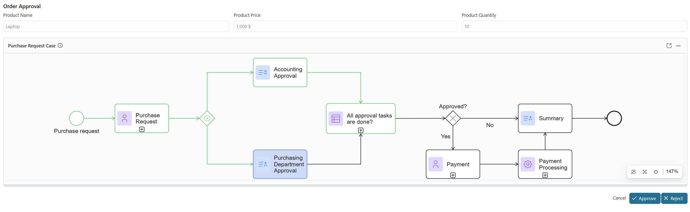

# Case Process Viewer

This Axon Ivy component visually represents the process flow of your current case. It highlights both the current active task and all completed tasks directly on the process diagram, helping users quickly understand the case’s progress at a glance. Designed for smooth UI integration, it can be easily embedded into any UI.

Key Features:

- Dynamically draws the process diagram of the current case

- Highlights the current task and completed tasks

- Provides an intuitive overview of case progress

- Simple to configure and integrate into existing Ivy user interfaces



## Demo

1. Start **Purchase Request Demo** process
2. Start **Purchase Request** task to view the status of the current task.


## Setup

**Add the Component to Your JSF Page**

   Include the component in your XHTML file using the following syntax:

   ```
   <ic:com.axonivy.solutions.caseprocessviewer.component.ProcessViewer header="Case Process Viewer" />
   ```

**Component Attributes**

| Attribute | Type | Required | Description |
|-----------|------|----------|-------------|
| `header` | `String` | No | Text label for the header (default: "Case Process Viewer") |